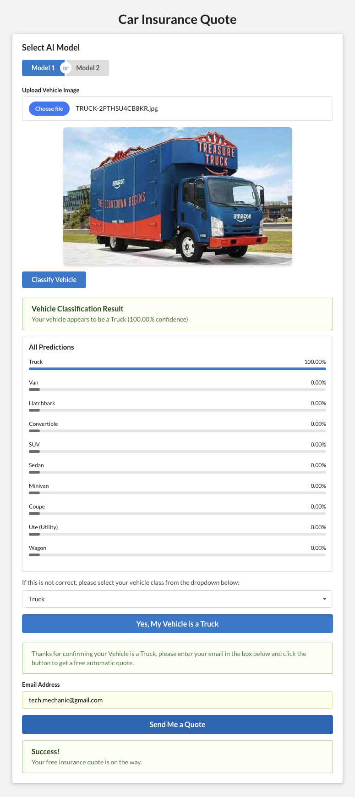

# Mission Ready Level 05 - Mission 01 - Express Backend and React Frontend

## Frontend UI (React, Tailwind CSS, Semantic UI, Vite (HMR))

  * Location: /
  * Start Command: npm run dev
  * URL: http://localhost:5173/

<br />
<div align="center">
  <a href="https://github.com/Astrotope/mr-level-05-fsd-mission-01-ai">
    
  </a>
</div>

## Backend API Endpoint Wrapper (Nodej.js, Express.js)

  * Location: /server
  * Start Command: npm start
  * URL: http://localhost:3111
  
## Prediction Endpoint Validation Images

  * This is a small set of validation images
  * For smoke testing the prediction endpoints
  * Location: /val-images

## Machine Learning Model Endpoints

  * Azure Custom Vision
    * https://mrlevel05fsdmission01customvision-prediction.cognitiveservices.azure.com/customvision/v3.0/Prediction/11b2df83-5803-4460-a114-7ab4050aacfb/classify/iterations/MR_VEHICLE_AI_ID_04/image
    * Request format:
      * Headers:
        * Prediction-Key: [Prediction Key]
        * Content-Type: application/octet-stream
      * Body:
        * form-data: {'image': file}
        * prediction endpoint image-size limit: 4MB
    * Example response:

```
{
    "id": "c0956445-31ae-499f-a92b-626c625ee0d1",
    "project": "11b2df83-5803-4460-a114-7ab4050aacfb",
    "iteration": "af81cf37-b99f-436f-bc5f-f266a260da81",
    "created": "2024-11-18T08:20:26.085Z",
    "predictions": [
        {
            "probability": 0.63082653,
            "tagId": "c39ed020-8ced-4318-b863-f070acf27de2",
            "tagName": "Minivan"
        },
        {
            "probability": 0.18555953,
            "tagId": "529d484d-a1a0-45b6-9cf3-f4cd8cc6cc16",
            "tagName": "Hatchback"
        },
        {
            "probability": 0.10000038,
            "tagId": "b8cad021-cc22-4c5a-a8e3-f348a7c6783a",
            "tagName": "SUV"
        },
        {
            "probability": 0.061792605,
            "tagId": "86f23547-c358-40d4-a678-1f3edd5d76af",
            "tagName": "Sedan"
        },
        {
            "probability": 0.01790969,
            "tagId": "a9d216fd-7f0d-41cb-bcfe-b308941f3793",
            "tagName": "Wagon"
        },
        {
            "probability": 0.0024593652,
            "tagId": "9081ce12-0c24-4233-b5c0-41f3f1bc4b47",
            "tagName": "Van"
        },
        {
            "probability": 0.0012291444,
            "tagId": "55603000-5d4e-47ca-9a9e-629e0998c96a",
            "tagName": "Coupe"
        },
        {
            "probability": 0.00017444807,
            "tagId": "d8c7acf0-d7da-48fd-bc0a-e0505f670bb1",
            "tagName": "Convertible"
        },
        {
            "probability": 4.8288697E-05,
            "tagId": "8b130c36-5f93-4d01-8321-03d59c31595d",
            "tagName": "Cab"
        }
    ]
}
```

  * Azuer ML Service Custom Endpoint
    * https://ai-vehicle-id-202411181207.australiaeast.inference.ml.azure.com/predict
    * No CORS implemented
      * will only work behind express, or with Postman (as it ignores CORS headers)
      * but will not pass browser CORS preflight
    * Request format:
      * Headers:
        * Content-Transfer-Encoding: application/json
        * Authorization: Bearer [API Key]
      * Body:
        * form-data: {'image': file}
    * Example response:

```
{
    "message": "Image and form data received and processed successfully!",
    "prediction": {
        "category": "minivan",
        "probability": 0.8009066581726074
    },
    "predictions": {
        "cab": 2.8805218335037353e-06,
        "convertible": 0.00022583271493203938,
        "coupe": 0.008298404514789581,
        "hatchback": 0.0649528056383133,
        "minivan": 0.8009066581726074,
        "sedan": 0.11703741550445557,
        "suv": 0.005763165187090635,
        "truck": 1.700457907816144e-08,
        "van": 0.002808869583532214,
        "wagon": 3.966191343351966e-06
    }
}
```

## Powered by React + Vite

This webapp is based on a  template that provides a minimal setup to get React working in Vite with HMR and some ESLint rules.

Currently, two official plugins are available:

- [@vitejs/plugin-react](https://github.com/vitejs/vite-plugin-react/blob/main/packages/plugin-react/README.md) uses [Babel](https://babeljs.io/) for Fast Refresh
- [@vitejs/plugin-react-swc](https://github.com/vitejs/vite-plugin-react-swc) uses [SWC](https://swc.rs/) for Fast Refresh

## Coded using  Windsurf (Agentic AI) Editor by Codeium

- [Windsurf by Codeim](https://codeium.com/windsurf)
  - "The first agentic IDE, and then some. The Windsurf Editor is where the work of developers and AI truly flow together, allowing for a coding experience that feels like literal magic."
